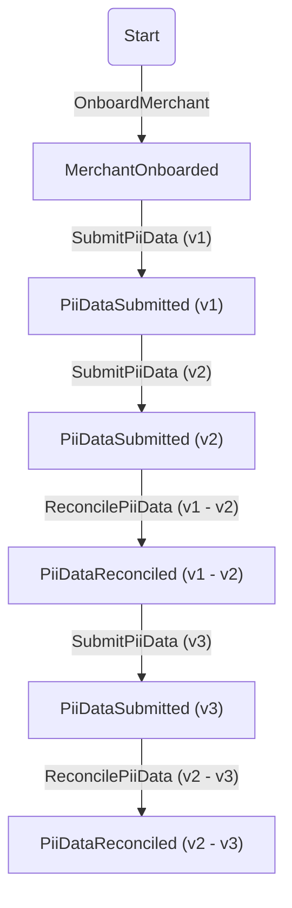

# Event Sourcing playground

This is my space to play with event sourcing, in Kotlin + Axon + Spring Boot.

For testing, use [HTTP scripts](./testing.http) and [SQL scripts](./testing.sql).

# Features

```
### Onboard merchant
POST /merchants

### Submit PII data
POST /merchants/{merchant_id}/pii-data

### Reconcile PII data
POST /merchants/{merchant_id}/pii-data/reconcile
```

<details>
<summary>Details</summary>



</details>

1. [x] Vertical slices architecture
2. [x] Aggregate ([Merchant](src/main/kotlin/com/michal/merchant/domain/Merchant.kt))
3. [x] Commands ([MerchantCommand](src/main/kotlin/com/michal/merchant/domain/command/MerchantCommand.kt))
4. [x] Events ([MerchantEvent](src/main/kotlin/com/michal/merchant/domain/event/MerchantEvent.kt))
5. [x] Unit tests ([MerchantTest](src/test/kotlin/com/michal/merchant/MerchantTest.kt))
6. [x] E2E tests ([MerchantE2eTest](src/test/kotlin/com/michal/merchant/MerchantE2eTest.kt))
7. [x] Command handler ([Merchant](src/main/kotlin/com/michal/merchant/domain/Merchant.kt))
8. [x] Event handler ([Merchant](src/main/kotlin/com/michal/merchant/domain/Merchant.kt))
9. [x] Eventsourcing handler ([MerchantReadModelProjector](src/main/kotlin/com/michal/merchant/merchants/internal/MerchantReadModelProjector.kt))
10. [x] Queries ([Query](src/main/kotlin/com/michal/sharedkernel/eventsourcing/Query.kt))
11. [x] Live read
    model ([PiiDataSubmissionReadModelQueryHandler](src/main/kotlin/com/michal/merchant/piidatasubmissions/internal/PiiDataSubmissionReadModelQueryHandler.kt))
12. [x] Database projected read model (
    async) ([MerchantReadModelProjector](src/main/kotlin/com/michal/merchant/merchants/internal/MerchantReadModelProjector.kt))
13. [x] Dead Letter Queue + retries ([MerchantReadModelProjector](src/main/kotlin/com/michal/merchant/merchants/internal/MerchantReadModelProjector.kt))

# TODO

1. [ ] Closing books - extend `Merchant` with `BusinessScreening` and demonstrate how to keep streams short (one aggregate does not need to be single stream)
   <details>
   <summary>Details</summary>

   ```mermaid
    flowchart TD
     A[MerchantOnboarded] --> B(PiiDataSubmitted)
     B --> C(OnboardingRiskAssessmentStarted)
     C -->|Onboarding Risk Assessment Stream| D[RiskAssessmentStarted]
     D --> E[FundingOffersCalculated]
     E --> F[BusinessKnockoutRulesPassed]
     F --> G[InitialBusinessScreeningPassed]
     G --> H[RiskAssessmentPassed]
     H --> I["OnboardingRiskAssessmentPassed (contains funding offers)"]
     C --> I
     I --> J[FundingOffersSentToCapital]
     J --> K[FundingOfferAccepted]
     K --> L(BeforePayoutBusinessScreeningStarted)
     L -->|Before Payout Business Screening Stream| M[BusinessScreeningStarted]
     M --> N[CreditSafeReportDownloaded]
     N --> O[BusinessKnockoutRulesPassed]
     O --> P[OpsTeamReviewPassed]
     P --> Q[RiskTeamReviewPassed]
     Q --> R[BusinessScreeningPassed]
     R --> S[BeforePayoutBusinessScreeningPassed]
     L --> S
     S --> T[PayoutApprovalSentToCapital]
   ```
   </details>
2. [ ] Retry mechanism on `@CommandHandler` with Spring or Axon's `RetryScheduler`
3. [ ] Replay mechanism, for instance when rebuilding projection ([article](https://www.axoniq.io/blog/axon-framework-4.6.0-replay-context-propagation))
4. [ ] Database projected read model (sync) - when projection fails, command handler fails too
5. [ ] Versioning - Upcasters - add some new change to event and demonstrate how to upcast the old events
6. [ ] Versioning - Breaking change - add some breaking change to event and demonstrate how to handle this
7. [ ] Unique constraint - extend onboarding of merchants and ensure that on each platform external IDs are unique
8. [ ] Show different types of aggregates
   <details>
   <summary>Details</summary>

    1. state object
       ```kotlin
       class Merchant {
         private val state: MerchantState
       }
 
       data class MerchantState(
         val aggregateId: MerchantId,
         val legalAddress: LegalAddress
       )
       ```
    2. everything in the aggregate
       ```kotlin
       class Merchant {
         private val aggregateId: MerchantId,
         private val legalAddress: LegalAddress
       }
       ```
    3. state being created by aggregating list of events
      ```kotlin
       class Merchant {
         private val events: List<MerchantEvent>
         
         private fun currentLegalAddress() = events.filterIsInstance<LegalAddressChanged>().last()
       }
      ```

   </details>
9. [ ] Spring Modulith for context separation + ArchUnit tests for architecture
10. [ ] GDPR and handling of sensitive data - add some field that must be anonymized when asked for
11. [ ] Migration strategies - CRUD to event sourcing
